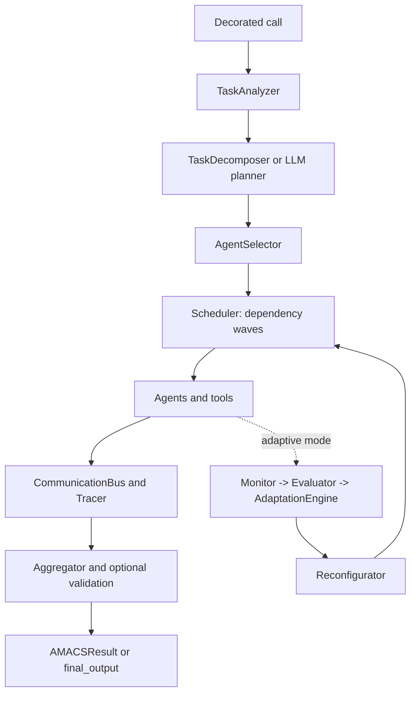

# AMACS

AMACS is a Python 3.9+ library for experimenting with adaptive multi-agent
orchestration behind the `@amacs(...)` decorator. It decomposes a task into
sub-tasks, schedules dependency-aware waves, calls a configured provider, and
aggregates the resulting text.

This repository is an alpha research and engineering project. The default
provider is an offline stub, and the included fixture benchmark measures
plumbing and fault recovery, not answer quality.

## Status

Implemented and tested locally:

- Synchronous and asynchronous `@amacs` wrappers backed by the shared `Pipeline`.
- Rule-based task analysis, template decomposition, DAG validation, and wave scheduling.
- Sync thread-pool and async wave execution with `max_agents` limits.
- OpenAI, Groq, Anthropic, Gemini, Ollama, and deterministic stub provider adapters, loaded lazily.
- Retry handling for retryable provider errors, per-agent timeout enforcement, token/cost budgets, and model pricing tables.
- Thread-safe communication bus, dependency-filtered context, tracing, optional response caching, and structured result details.
- Optional adaptive monitoring between waves and during a wave. It can record quality, failure, latency, and budget signals, retry with another agent, swap agents, skip optional work, or reduce the remaining team.
- Optional `debate`, `manager_worker`, and LLM planner modes. These are experimental interfaces, not validated quality improvements.
- Built-in tools with a mock search backend, a bounded search-agent tool loop, a local vector-store adapter, and an AST-restricted calculator.

Not established by this repository:

- Better answer quality than a single LLM call.
- A real web search service in the default configuration.
- Published PyPI distribution or stable production compatibility.
- A current comparison across providers, model IDs, domains, or real-world datasets.

## Installation From This Checkout

The project is not claiming a PyPI release. Install the checkout instead:

```bash
python -m pip install .
python -m pip install ".[dev]"       # tests and verification tools
python -m pip install ".[openai]"    # optional provider SDK
python -m pip install ".[groq]"       # optional Groq provider SDK
```

Core runtime dependencies are `pydantic` and `tenacity`. Provider SDKs,
vector databases, and monitoring integrations are optional extras.

## Quick Start

```python
from amacs import amacs

@amacs(strategy="performance")
def research(topic: str) -> str:
    return f"Research topic: {topic}"

print(research("renewable energy"))
```

The function body is used to produce the task input by default; AMACS does not
return the function's ordinary return value. Use `task="..."` for an explicit
prompt, `input_mode="return_value_as_prompt"` to make the return value the
prompt explicitly, or `return_details=True` to receive an `AMACSResult`.

```python
@amacs(task="Summarise the supplied topic", return_details=True, adaptive=True)
def summarise(topic: str) -> str:
    return topic

result = summarise("grid storage")
print(result.final_output)
print(result.trace.to_json())
```

The public compatibility surface includes `max_agents`, `strategy`, and
`adaptive`, alongside configuration for provider, model, retry limit, timeout,
budgets, cache, planner, coordination mode, and structured output validation.

## Execution Model



The template planner is intentionally conservative: most built-in templates
form a search, analysis, writing, and validation chain. Independent tasks can
share a wave, but the default research template is mostly sequential. The
validator pass is a structured review; it only replaces the merged text when a
non-trivial revision passes the configured length ratio.

## Providers And Tools

Set `AMACS_LLM_PROVIDER` or pass `llm_provider=...`. Without configuration,
AMACS uses the deterministic `stub` provider so the default tests need no
network and no API key. The default `WebSearchTool` uses `MockSearchBackend` and
labels its output as mock data. Applications can supply a real `SearchBackend`.

Supported provider names are `stub`, `openai`, `groq`, `anthropic`, `gemini`, and
`ollama`. Provider model defaults are defined in the provider module and can be
overridden with `llm_model` or per-agent `models={...}`. Verify provider model
availability with the provider's current official documentation before making
live calls; this project does not assert that every default remains current.

For Groq, set `GROQ_API_KEY` and select the provider:

```bash
export GROQ_API_KEY="your-key"
export AMACS_LLM_PROVIDER=groq
```

Provider responses expose normalized content, usage, structured JSON, and tool
calls (`{id, name, arguments}`). Pass `output_schema` with a Pydantic model for
provider-native JSON guidance; tool execution is traced and bounded by
`max_tool_steps`. Provider SDK tests use mocks and `FakeProvider`, so API keys
are never required by normal tests.

Tracing records pipeline stages, waves, nested coordination, provider calls,
tools, cache hits, context truncation, retries, budgets, and adaptation actions.
OpenTelemetry export is optional and never required for local execution.

## Benchmarks

The checked-in `benchmarks/results/report.md` is a deterministic fixture run
with the stub provider. It is a recovery and overhead smoke test, not evidence
of model quality. Every report includes mean, standard deviation, and 95% CI
for latency, success, cost, and token usage, plus recovery rate.

| system | runs | success mean | success std | success CI95 | recovery rate | latency mean (s) | latency std | latency CI95 | cost mean | tokens mean |
|---|---:|---:|---:|---:|---:|---:|---:|---:|---:|---:|
| B0-B5 | see `benchmarks/results/report.md` | recorded fixture statistics | | | | | | | | |

The fixture's success predicate is string containment against expected fixture
text. It does not evaluate correctness, factuality, cost quality, or user
preference. Reproduce it with `make bench-fixture`. Full runs require a
locally available dataset and the selected provider SDK; they may require API
credentials and are never part of normal tests or CI:

```bash
python -m benchmarks.run --full --dataset reasoning --provider openai \
    --systems B0,B1,B2,B3,B4,B5 --repetitions 3
python -m benchmarks.run --full --dataset coding --provider ollama \
    --systems B2,B5 --repetitions 2
```

Use `--ablation adaptation`, `--ablation coordination`, `--ablation caching`,
or `--ablation strategy` to label reproducible ablation runs. Dataset provenance
and licensing requirements are documented in `benchmarks/datasets/README.md`.

## Package Structure

The implementation lives under `amacs/`. `amacs/communication/bus.py` and
`amacs/aggregation/aggregator.py` are compatibility exports; the implementations
are in `communication/__init__.py` and `aggregation/__init__.py` respectively.

```text
amacs/
  decorator.py, pipeline.py, config.py, executor.py, results.py
  agents/              provider-backed role agents and BaseAgent
  adaptive/            monitor, evaluator, policy engine, reconfigurator
  aggregation/         merge and validation implementation
  communication/        shared bus implementation
  coordination/         experimental debate and manager-worker modes
  integrations/         provider, vector-store, and monitoring adapters
  orchestrator/         analysis, decomposition, selection, and scheduling
  tools/                calculator, search, vector, and registry tools
  cache.py, tracing.py, pricing.py
benchmarks/              offline fixture harness and report
tests/                   offline regression and behavioral tests
```

## Verification

```bash
make verify
```

The verification target runs Ruff, mypy, pytest with coverage, the fixture
benchmark, an offline wheel build, a fresh virtual-environment install, the
CLI smoke test, and the example. It does not make live API calls.

For the research context and known trade-offs, see
[`docs/architecture.md`](docs/architecture.md),
[`docs/adaptation.md`](docs/adaptation.md),
[`docs/evaluation.md`](docs/evaluation.md), and
[`docs/paper_notes.md`](docs/paper_notes.md).

## Limitations

The default task templates are linear enough that parallelism is workload
dependent. The mock search backend is not retrieval. Provider behavior,
pricing, latency, and model availability are external. Sync timeout handling
releases the caller after the timeout, but the underlying Python worker thread
may finish in the background. Adaptive actions change remaining execution and
can retry work, but they are not a learned policy and have no demonstrated
quality advantage. The repository has no verified real-task benchmark and no
claim of production readiness.

## License

MIT. See [`LICENSE`](LICENSE).
