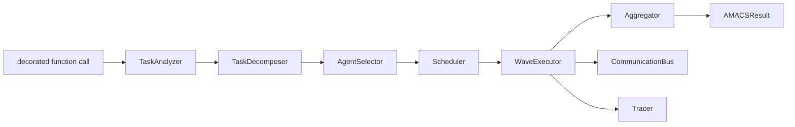
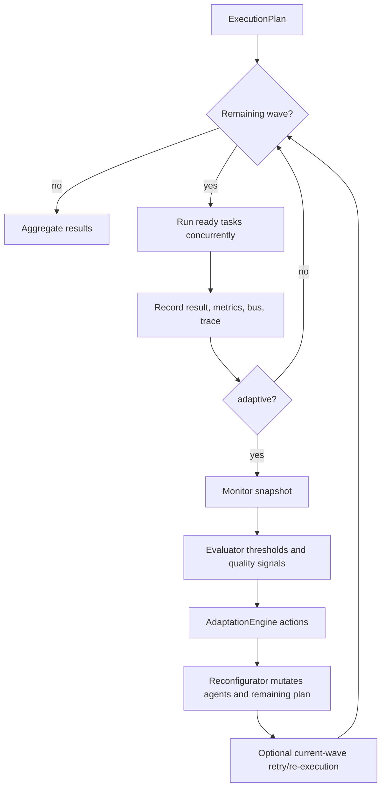
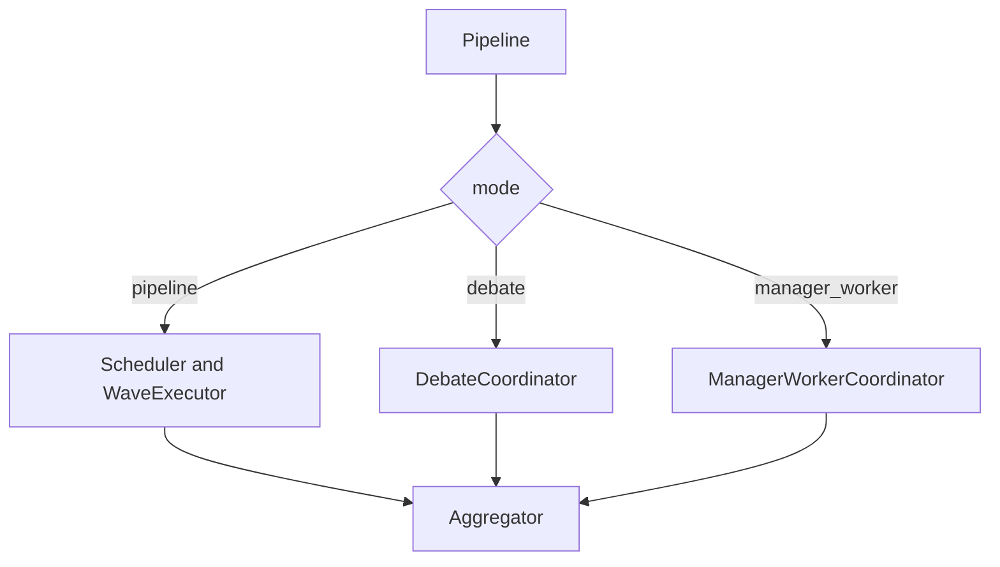

# Architecture

AMACS is a library pipeline, not a distributed agent runtime. One decorated call creates one `Pipeline`, one communication bus, one tracer, and one set of agents. Providers are called through the `LLMProvider` interface.

## Pipeline

`planner="llm"` replaces the template decomposer with `LLMTaskDecomposer`; invalid or unsafe plans fall back to the template path. The default `pipeline` mode uses `WaveExecutor`. `debate` and `manager_worker` are alternate coordinator paths.

## Wave Loop And Adaptation

Adaptation is bounded by swap limits and the configured budget. A synchronous timeout releases the caller after the timeout, although its worker thread may finish later; this is a Python executor limitation.

## Coordination Modes

The coordination modes share providers, configuration, bus, and result types, but their quality has not been compared in a real-task study. Agent role prompts are distinct, but a provider still determines the generated content.

## Ownership Boundaries

- `decorator.py` preserves the public API and dispatches sync versus async calls.
- `pipeline.py` prepares, executes, and finalizes one call.
- `orchestrator/` owns task understanding, decomposition, selection, and scheduling.
- `agents/` owns prompts, provider calls, retries, timeouts, tool context, and revisions.
- `executor.py` owns waves, budgets, metrics, and adaptation.
- `aggregation/` owns ordering, validation, and final merge.
- `cache.py` and `tracing.py` are opt-in runtime services.

The compatibility modules `communication/bus.py` and `aggregation/aggregator.py` re-export implementations; they are not separate implementations.
